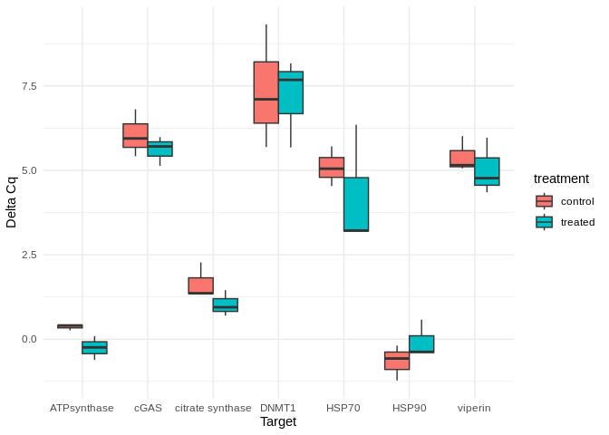
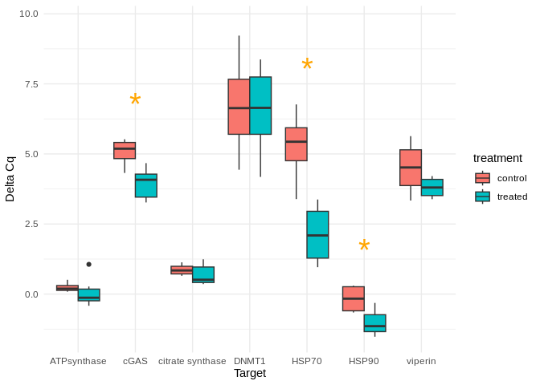
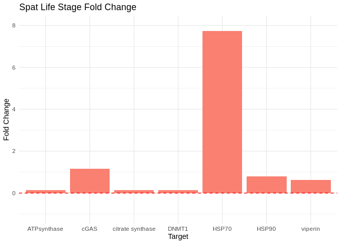

20240327-cgig-lifestage-carryover-qpcr-analysis
================
Sam White
2024-03-27

- <a href="#1-analysis" id="toc-1-analysis">1 ANALYSIS</a>
  - <a href="#11-load-libraries" id="toc-11-load-libraries">1.1 Load
    libraries</a>
  - <a href="#12-set-variables" id="toc-12-set-variables">1.2 Set
    variables</a>
  - <a href="#13-functions" id="toc-13-functions">1.3 Functions</a>
  - <a href="#14-read-in-files" id="toc-14-read-in-files">1.4 Read in
    files</a>
  - <a href="#15-unique-samples-by-target"
    id="toc-15-unique-samples-by-target">1.5 Unique samples by target</a>
  - <a href="#16-add-life-stage-and-treatment-cols"
    id="toc-16-add-life-stage-and-treatment-cols">1.6 Add life stage and
    treatment cols</a>
  - <a href="#17-delta-cq-to-normalizing-gene"
    id="toc-17-delta-cq-to-normalizing-gene">1.7 Delta Cq to Normalizing
    Gene</a>
  - <a href="#18-t-tests" id="toc-18-t-tests">1.8 T-tests</a>
  - <a href="#19-delta-cq-box-plots" id="toc-19-delta-cq-box-plots">1.9
    Delta Cq Box Plots</a>
    - <a href="#191-seed" id="toc-191-seed">1.9.1 Seed</a>
    - <a href="#192-spat" id="toc-192-spat">1.9.2 Spat</a>
  - <a href="#110-delta-delta-cq" id="toc-110-delta-delta-cq">1.10 Delta
    delta Cq</a>
    - <a href="#1101-add-treatment-and-life-stage"
      id="toc-1101-add-treatment-and-life-stage">1.10.1 Add treatment and life
      stage</a>
    - <a href="#1102-mean-cqs-per-gene-per-treatment-per-life-stage"
      id="toc-1102-mean-cqs-per-gene-per-treatment-per-life-stage">1.10.2 Mean
      Cqs per gene per treatment per life stage</a>
    - <a href="#1103-delta-cqs" id="toc-1103-delta-cqs">1.10.3 Delta Cqs</a>
    - <a href="#1104-delta-delta-cq" id="toc-1104-delta-delta-cq">1.10.4 Delta
      delta Cq</a>
    - <a href="#1105-calculate-the-fold-change-for-each-target"
      id="toc-1105-calculate-the-fold-change-for-each-target">1.10.5 Calculate
      the fold change for each Target</a>
    - <a href="#1106-plot---seed-fold-change"
      id="toc-1106-plot---seed-fold-change">1.10.6 Plot - Seed Fold Change</a>
    - <a href="#1107-plot---spat-fold-change"
      id="toc-1107-plot---spat-fold-change">1.10.7 Plot - Spat Fold Change</a>

# 1 ANALYSIS

## 1.1 Load libraries

``` r
if ("tidyverse" %in% rownames(installed.packages()) == 'FALSE') install.packages('tidyverse')

library("tidyverse")
library("ggplot2")
```

## 1.2 Set variables

``` r
seed.control <- c("223", "243", "244")
seed.treated <- c("200", "257", "285")
spat.control <- c("206", "282", "284", "289")
spat.treated <- c("220", "226", "242", "253", "296", "298")

# Combine vectors into a list
vector_list <- list(seed.control = seed.control,
                    seed.treated = seed.treated,
                    spat.control = spat.control,
                    spat.treated = spat.treated)
```

## 1.3 Functions

``` r
calculate_delta_Cq <- function(df) {
  df <- df %>%
    group_by(Sample) %>%
    mutate(delta_Cq = Cq.Mean - Cq.Mean[Target == "GAPDH"]) %>%
    ungroup()
  
  return(df)
}
```

## 1.4 Read in files

``` r
# Set the directory where your CSV files are located
cqs_directory <- "../data/"

# Get a list of all CSV files in the directory with the naming structure "*Cq_Results.csv"
cq_file_list <- list() # Initialize list
cq_file_list <- list.files(path = cqs_directory, pattern = "Cq_Results\\.csv$", full.names = TRUE)

# Initialize an empty list to store the data frames
data_frames <- list()

# Loop through each file and read it into a data frame, then add it to the list
for (file in cq_file_list) {
  data <- read.csv(file, header = TRUE)
  data_frames[[file]] <- data
}

# Combine all data frames into a single data frame
combined_df <- bind_rows(data_frames, .id = "data_frame_id")

# Convert Sample column to character type
combined_df <- combined_df %>%
  mutate(Sample = as.character(Sample))

str(combined_df)
```

    'data.frame':   272 obs. of  17 variables:
     $ data_frame_id         : chr  "../data//sam_2024-03-25_06-10-54_Connect-Quantification-Cq_Results.csv" "../data//sam_2024-03-25_06-10-54_Connect-Quantification-Cq_Results.csv" "../data//sam_2024-03-25_06-10-54_Connect-Quantification-Cq_Results.csv" "../data//sam_2024-03-25_06-10-54_Connect-Quantification-Cq_Results.csv" ...
     $ X                     : logi  NA NA NA NA NA NA ...
     $ Well                  : chr  "A01" "A02" "A03" "A04" ...
     $ Fluor                 : chr  "SYBR" "SYBR" "SYBR" "SYBR" ...
     $ Target                : chr  "ATPsynthase" "ATPsynthase" "ATPsynthase" "ATPsynthase" ...
     $ Content               : chr  "Unkn-01" "Unkn-01" "Unkn-02" "Unkn-02" ...
     $ Sample                : chr  "206" "206" "220" "220" ...
     $ Biological.Set.Name   : logi  NA NA NA NA NA NA ...
     $ Cq                    : num  26.7 26.7 25.8 25.9 25.1 ...
     $ Cq.Mean               : num  26.7 26.7 25.9 25.9 25.1 ...
     $ Cq.Std..Dev           : num  0.0455 0.0455 0.0239 0.0239 0.0813 ...
     $ Starting.Quantity..SQ.: num  NaN NaN NaN NaN NaN NaN NaN NaN NaN NaN ...
     $ Log.Starting.Quantity : num  NaN NaN NaN NaN NaN NaN NaN NaN NaN NaN ...
     $ SQ.Mean               : num  NaN NaN NaN NaN NaN NaN NaN NaN NaN NaN ...
     $ SQ.Std..Dev           : num  NaN NaN NaN NaN NaN NaN NaN NaN NaN NaN ...
     $ Set.Point             : int  60 60 60 60 60 60 60 60 60 60 ...
     $ Well.Note             : logi  NA NA NA NA NA NA ...

## 1.5 Unique samples by target

``` r
# Group by Sample and Target, then summarize to get unique rows for each sample
aggregated_df <- combined_df %>%
  group_by(Sample, Target) %>%
  summarize(Cq.Mean = mean(Cq.Mean, na.rm = TRUE)) %>%
  ungroup()

str(aggregated_df)
```

    tibble [136 × 3] (S3: tbl_df/tbl/data.frame)
     $ Sample : chr [1:136] "200" "200" "200" "200" ...
     $ Target : chr [1:136] "ATPsynthase" "DNMT1" "GAPDH" "HSP70" ...
     $ Cq.Mean: num [1:136] 25.2 33.6 25.4 31.8 26 ...

## 1.6 Add life stage and treatment cols

``` r
# Initialize new columns
aggregated_df <- aggregated_df %>%
  mutate(life.stage = NA_character_,
         treatment = NA_character_)

# Loop through each vector
for (vec_name in names(vector_list)) {
  vec <- vector_list[[vec_name]]
  stage <- strsplit(vec_name, "\\.")[[1]][1]
  treatment <- strsplit(vec_name, "\\.")[[1]][2]
  
  # Loop through each row in aggregated_df
  for (i in 1:nrow(aggregated_df)) {
    sample <- aggregated_df$Sample[i]
    
    # Check if sample is in the vector
    if (sample %in% vec) {
      # Update life.stage and treatment columns
      aggregated_df$life.stage[i] <- stage
      aggregated_df$treatment[i] <- treatment
    }
  }
}

str(aggregated_df)
```

    tibble [136 × 5] (S3: tbl_df/tbl/data.frame)
     $ Sample    : chr [1:136] "200" "200" "200" "200" ...
     $ Target    : chr [1:136] "ATPsynthase" "DNMT1" "GAPDH" "HSP70" ...
     $ Cq.Mean   : num [1:136] 25.2 33.6 25.4 31.8 26 ...
     $ life.stage: chr [1:136] "seed" "seed" "seed" "seed" ...
     $ treatment : chr [1:136] "treated" "treated" "treated" "treated" ...

## 1.7 Delta Cq to Normalizing Gene

``` r
# Calculate delta Cq by subtracting GAPDH Cq.Mean from each corresponding Sample Cq.Mean
delta_Cq_df <- calculate_delta_Cq(aggregated_df)

str(delta_Cq_df)
```

    tibble [136 × 6] (S3: tbl_df/tbl/data.frame)
     $ Sample    : chr [1:136] "200" "200" "200" "200" ...
     $ Target    : chr [1:136] "ATPsynthase" "DNMT1" "GAPDH" "HSP70" ...
     $ Cq.Mean   : num [1:136] 25.2 33.6 25.4 31.8 26 ...
     $ life.stage: chr [1:136] "seed" "seed" "seed" "seed" ...
     $ treatment : chr [1:136] "treated" "treated" "treated" "treated" ...
     $ delta_Cq  : num [1:136] -0.243 8.168 0 6.349 0.578 ...

## 1.8 T-tests

``` r
# Filter out groups with missing life.stage or Target
# Caused by NTCs
# Also removes normalizing gene(s)
delta_Cq_df_filtered <- delta_Cq_df %>%
  filter(!is.na(life.stage), !is.na(Target), Target != "GAPDH")

# Perform t-test for each Target within life.stage
t_test_results <- delta_Cq_df_filtered %>%
  group_by(life.stage, Target) %>%
  summarise(
    t_test_result = list(t.test(delta_Cq ~ treatment))
  ) %>%
  ungroup()

# Extract t-test statistics
t_test_results <- t_test_results %>%
  mutate(
    estimate_diff = sapply(t_test_result, function(x) x$estimate[1] - x$estimate[2]),
    p_value = sapply(t_test_result, function(x) x$p.value)
  ) %>% 
  select(!t_test_result)

# Add asterisk information to data frame
# Useful for plotting
t_test_results$asterisk <- ifelse(t_test_results$p_value < 0.05, "*", "")
```

## 1.9 Delta Cq Box Plots

### 1.9.1 Seed

``` r
library(ggplot2)

# Filter delta_Cq_df_filtered for seed life stage
seed_delta_Cq_df <- delta_Cq_df_filtered %>%
  filter(life.stage == "seed")

# Create the box plot
boxplot <- ggplot(seed_delta_Cq_df, aes(x = Target, y = delta_Cq, fill = treatment)) +
  geom_boxplot(position = position_dodge(width = 0.75)) +
  theme_minimal() +
  theme(legend.position = "right") +
  labs(x = "Target", y = "Delta Cq")

# Add asterisks
boxplot +
  annotate("text", x = t_test_results$Target, y = Inf, label = t_test_results$asterisk,
           vjust = -0.5, size = 4, color = "orange")
```

<div class="figure">



<p class="caption">

Box plots comparing GAPDH-normalized gene expression (delta Cq) between
control and treated seed.

</p>

</div>

### 1.9.2 Spat

``` r
# Filter data for life.stage = "spat"
spat_delta_Cq <- delta_Cq_df_filtered %>%
  filter(life.stage == "spat")

# Calculate the maximum delta_Cq for each Target
max_delta_Cq_by_target <- spat_delta_Cq %>%
  group_by(Target) %>%
  summarise(max_delta_Cq = max(delta_Cq, na.rm = TRUE))

# Merge t_test_results with max_delta_Cq_by_target to get the maximum delta_Cq for each Target
t_test_results_with_max_delta_Cq <- merge(t_test_results, max_delta_Cq_by_target, by = "Target")


# Create the box plot
boxplot <- ggplot(spat_delta_Cq, aes(x = Target, y = delta_Cq, fill = treatment)) +
  geom_boxplot(position = position_dodge(width = 0.75)) +
  theme_minimal() +
  theme(legend.position = "right") +
  labs(x = "Target", y = "Delta Cq")

# Add asterisks
boxplot +
  annotate("text", x = t_test_results_with_max_delta_Cq$Target, 
           y = t_test_results_with_max_delta_Cq$max_delta_Cq + 0.5, 
           label = t_test_results_with_max_delta_Cq$asterisk,
           vjust = -0.5, size = 10, color = "orange")
```

<div class="figure">



<p class="caption">

Box plots comparing GAPDH-normalized gene expression (delta Cq) between
control and treated spat.

</p>

</div>

## 1.10 Delta delta Cq

### 1.10.1 Add treatment and life stage

``` r
# Initialize empty vectors to store life.stage and treatment
life_stage <- character(nrow(combined_df))
treatment <- character(nrow(combined_df))

# Loop through each row of combined_df
for (i in 1:nrow(combined_df)) {
  sample_id <- combined_df$Sample[i]
  
  # Check if the sample_id is present in any of the vectors
  found <- FALSE
  for (vec_name in names(vector_list)) {
    if (sample_id %in% vector_list[[vec_name]]) {
      # If present, extract life.stage and treatment from the vector name
      parts <- strsplit(vec_name, "\\.")[[1]]
      life_stage[i] <- parts[1]
      treatment[i] <- parts[2]
      found <- TRUE
      break  # Exit loop once found
    }
  }
  
  # If sample_id is not found in any vector, assign NA to both life.stage and treatment
  if (!found) {
    life_stage[i] <- NA
    treatment[i] <- NA
  }
}

# Add life.stage and treatment columns to combined_df
combined_df <- combined_df %>%
  mutate(life.stage = life_stage,
         treatment = treatment)

# Filter out rows where life.stage is NA
combined_df_filtered <- combined_df %>% 
  filter(!is.na(life.stage))

str(combined_df_filtered)
```

    'data.frame':   256 obs. of  19 variables:
     $ data_frame_id         : chr  "../data//sam_2024-03-25_06-10-54_Connect-Quantification-Cq_Results.csv" "../data//sam_2024-03-25_06-10-54_Connect-Quantification-Cq_Results.csv" "../data//sam_2024-03-25_06-10-54_Connect-Quantification-Cq_Results.csv" "../data//sam_2024-03-25_06-10-54_Connect-Quantification-Cq_Results.csv" ...
     $ X                     : logi  NA NA NA NA NA NA ...
     $ Well                  : chr  "A01" "A02" "A03" "A04" ...
     $ Fluor                 : chr  "SYBR" "SYBR" "SYBR" "SYBR" ...
     $ Target                : chr  "ATPsynthase" "ATPsynthase" "ATPsynthase" "ATPsynthase" ...
     $ Content               : chr  "Unkn-01" "Unkn-01" "Unkn-02" "Unkn-02" ...
     $ Sample                : chr  "206" "206" "220" "220" ...
     $ Biological.Set.Name   : logi  NA NA NA NA NA NA ...
     $ Cq                    : num  26.7 26.7 25.8 25.9 25.1 ...
     $ Cq.Mean               : num  26.7 26.7 25.9 25.9 25.1 ...
     $ Cq.Std..Dev           : num  0.0455 0.0455 0.0239 0.0239 0.0813 ...
     $ Starting.Quantity..SQ.: num  NaN NaN NaN NaN NaN NaN NaN NaN NaN NaN ...
     $ Log.Starting.Quantity : num  NaN NaN NaN NaN NaN NaN NaN NaN NaN NaN ...
     $ SQ.Mean               : num  NaN NaN NaN NaN NaN NaN NaN NaN NaN NaN ...
     $ SQ.Std..Dev           : num  NaN NaN NaN NaN NaN NaN NaN NaN NaN NaN ...
     $ Set.Point             : int  60 60 60 60 60 60 60 60 60 60 ...
     $ Well.Note             : logi  NA NA NA NA NA NA ...
     $ life.stage            : chr  "spat" "spat" "spat" "spat" ...
     $ treatment             : chr  "control" "control" "treated" "treated" ...

### 1.10.2 Mean Cqs per gene per treatment per life stage

``` r
# Group by life.stage, treatment, and Target, then calculate the mean Cq
mean_Cq_df <- combined_df_filtered %>%
  group_by(life.stage, treatment, Target) %>%
  summarise(mean_Cq = mean(Cq, na.rm = TRUE))
```

### 1.10.3 Delta Cqs

``` r
# Calculate delta Cq
combined_df_with_delta_Cq <- mean_Cq_df %>%
  group_by(life.stage, treatment) %>%
  mutate(delta_Cq = mean_Cq - mean(mean_Cq[Target == "GAPDH"])) %>%
  ungroup() %>% 
  filter(Target != "GAPDH")
```

### 1.10.4 Delta delta Cq

``` r
# Calculate delta_delta_Cq
delta_delta_Cq_df <- combined_df_with_delta_Cq %>%
  group_by(life.stage, Target) %>%
  summarize(delta_delta_Cq = delta_Cq[treatment == "treated"] - delta_Cq[treatment == "control"])
```

### 1.10.5 Calculate the fold change for each Target

``` r
delta_delta_fold_change <- delta_delta_Cq_df %>%
  mutate(fold_change = 2^(-delta_delta_Cq)) %>% 
  distinct(Target, fold_change)

str(delta_delta_fold_change)
```

    gropd_df [14 × 3] (S3: grouped_df/tbl_df/tbl/data.frame)
     $ life.stage : chr [1:14] "seed" "seed" "seed" "seed" ...
     $ Target     : chr [1:14] "ATPsynthase" "DNMT1" "HSP70" "HSP90" ...
     $ fold_change: num [1:14] 1.532 1.146 1.8 0.662 1.365 ...
     - attr(*, "groups")= tibble [2 × 2] (S3: tbl_df/tbl/data.frame)
      ..$ life.stage: chr [1:2] "seed" "spat"
      ..$ .rows     : list<int> [1:2] 
      .. ..$ : int [1:7] 1 2 3 4 5 6 7
      .. ..$ : int [1:7] 8 9 10 11 12 13 14
      .. ..@ ptype: int(0) 
      ..- attr(*, ".drop")= logi TRUE

### 1.10.6 Plot - Seed Fold Change

``` r
# Filter delta_delta_fold_change for seed life stage
seed_df <- delta_delta_fold_change %>%
  filter(life.stage == "seed")

# Create bar plot for seed life stage
# Create the plot with fold changes relative to baseline of 1
seed_plot <- ggplot(seed_df, aes(x = Target, y = fold_change - 1)) +
  geom_bar(stat = "identity", fill = "skyblue") +
  geom_hline(yintercept = 0, linetype = "dashed", color = "red") +  # Baseline
  theme_minimal() +
  labs(x = "Target", y = "Fold Change", title = "Seed Life Stage Fold Change") +
  scale_y_continuous(limits = c(-0.5, 1))

# Display plot
seed_plot
```

<div class="figure">


<p class="caption">

Bar plots showing fold change in expression (2^(-delta delta Cq)) in
seed.

</p>

</div>

### 1.10.7 Plot - Spat Fold Change

``` r
# Filter delta_delta_fold_change for spat life stage
spat_df <- delta_delta_fold_change %>%
  filter(life.stage == "spat")

# Create bar plot for spat life stage
# Create the plot with fold changes relative to baseline of 1
spat_plot <- ggplot(spat_df, aes(x = Target, y = fold_change - 1)) +
  geom_bar(stat = "identity", fill = "salmon") +
  geom_hline(yintercept = 0, linetype = "dashed", color = "red") +  # Baseline
  theme_minimal() +
  labs(x = "Target", y = "Fold Change", title = "Spat Life Stage Fold Change") +
  scale_y_continuous(limits = c(-1, 8))

# Display plot
spat_plot
```

<div class="figure">



<p class="caption">

Bar plots showing fold change in expression (2^(-delta delta Cq)) in
spat.

</p>

</div>
