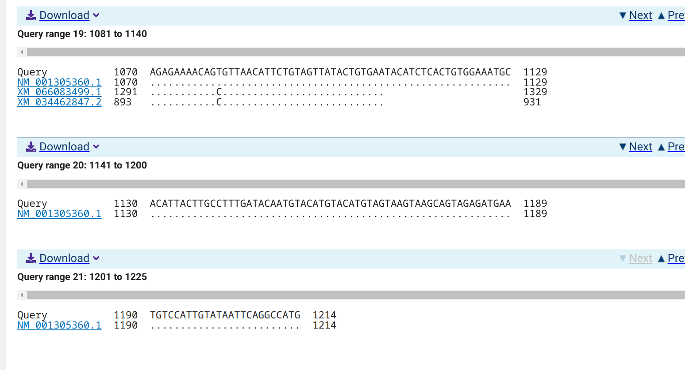
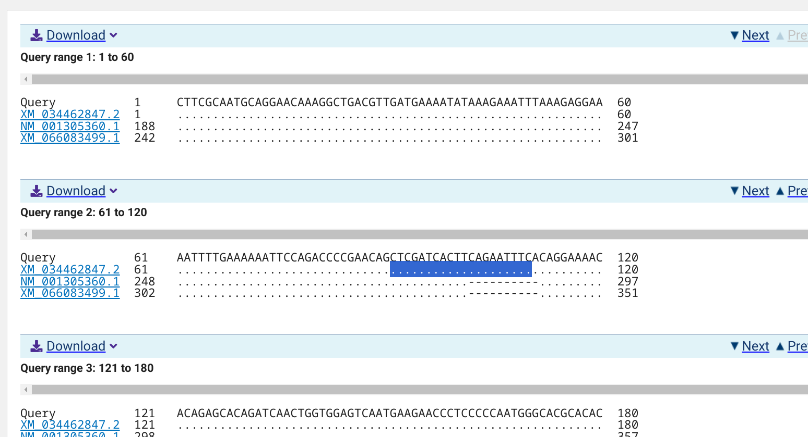
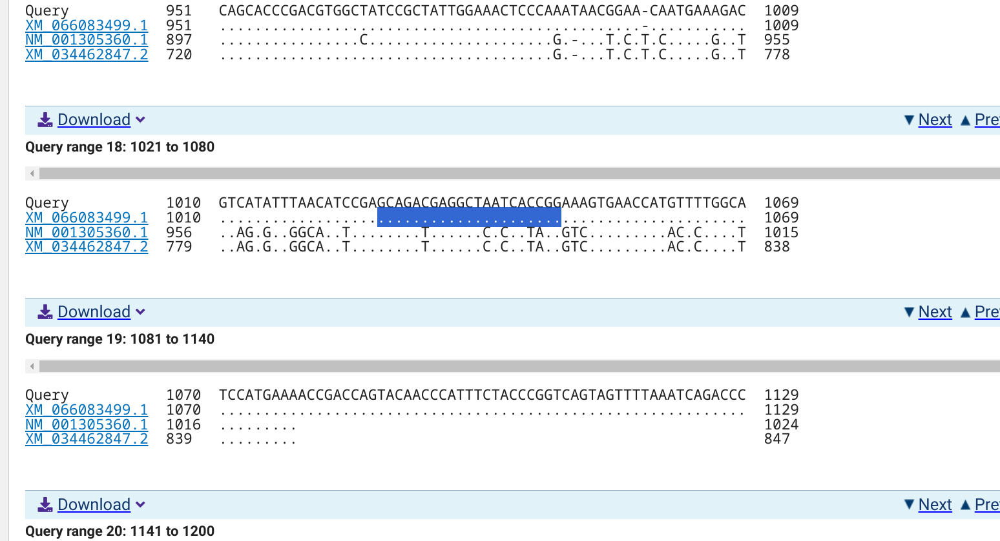

```{r setup, include=FALSE}
knitr::opts_chunk$set(
  echo = TRUE,         # Display code chunks
  eval = FALSE,        # Evaluate code chunks
  warning = FALSE,     # Hide warnings
  message = FALSE,     # Hide messages
  comment = ""         # Prevents appending '##' to beginning of lines in code output
)
```

# Background

This notebook describes using [Primer3](https://github.com/primer3-org/primer3) [@untergasser2012; @koressaar2007] to reproducibly design qPCR primers for *Crassostrea gigas* (*Magallana gigas*) [alternative oxidase (AOX)](https://en.wikipedia.org/wiki/Alternative_oxidase) (Wikipedia) isoforms. Alternative oxidase is a mitochondrial gene/enzyme known to be responsive to oxidative stress, so this may be a useful biomarker that we haven't previously considered.

Isoforms of AOX in *Crassostrea gigas* (*Magallana gigas*) were identified by running BLASTx using the [*Arabidopsis* AOX1a nucleotide sequence (NM_113135.4)](https://www.ncbi.nlm.nih.gov/sites/entrez?cmd=Search&db=nucleotide&term=NM_113135.4&dopt=GenBank) as a query against the *Crassostrea gigas* (*Magallana gigas*) genome using NCBI's web-based BLAST interface.

BLASTx returned three matches:

-   [NP_001292289.1](https://www.ncbi.nlm.nih.gov/protein/NP_001292289.1?report=genbank&log$=protalign&blast_rank=1&RID=SMV9RMT6013): alternative oxidase, mitochondrial-like [Magallana gigas]

    -   Nucleotide: [`NM_001305360.1`](https://www.ncbi.nlm.nih.gov/nuccore/NM_001305360.1)

    -   Gene: `LOC105322704`

-   [`XP_034318738.2`](https://www.ncbi.nlm.nih.gov/protein/XP_034318738.2?report=genbank&log$=protalign&blast_rank=2&RID=SMV9RMT6013): alternative oxidase, mitochondrial-like isoform X2 [Magallana gigas]

    -   Nucleotide: [`XM_034462847.2`](https://www.ncbi.nlm.nih.gov/nuccore/XM_034462847.2)

    -   Gene: `LOC105322704`

-   [`XP_065939571.1`](https://www.ncbi.nlm.nih.gov/protein/XP_065939571.1?report=genbank&log$=protalign&blast_rank=3&RID=SMV9RMT6013): alternative oxidase, mitochondrial-like isoform X1 [Magallana gigas]

    -   Nucleotide: [`XM_066083499.1`](https://www.ncbi.nlm.nih.gov/nuccore/XM_066083499.1)

    -   Gene: `LOC105322704`

## Input files

- Target FastA sequences

- Genome FastA

## Output files

- `emboss-primers.txt`: Output from EMBOSS PrimerSearch containing primer pair matches within the genome.

- `*primer3-primers-default-format.txt`: The default output format containing Primer3 primer identification info. Machine-readable format.

- `*primer3-primers.txt`: Primer3 output file containing primer identification info. An easy-to-read format.

## Required software

Utilizes NCBI's [e-utilities](https://www.ncbi.nlm.nih.gov/books/NBK179288/#chapter6.Getting_Started) [@kans2013entrez] for fetching FastA sequences.

This process also utilizes [pyfaidx](https://github.com/mdshw5/pyfaidx) [@shirley2015].

[EMBOSS PrimerSearch](https://emboss.sourceforge.net/apps/cvs/emboss/apps/primersearch.html) [@rice2000] will be utilized to assess primer specificity across the genome.

# CREATE BASH VARIABLES FILE

This allows usage of Bash variables across R Markdown chunks.

```{r save-bash-variables-to-rvars-file, engine='bash', eval=TRUE}
{
echo "#### Assign Variables ####"
echo ""

echo "# DATA DIRECTORIES"
echo 'export data_dir="../data"'
echo 'export output_top="../output"'
echo 'export genome_fasta_splits_dir="${data_dir}/fasta_splits"'
echo ""

echo "# SEQUENCES"
echo 'export sequence_IDs=(XM_066083499.1 XM_034462847.2 NM_001305360.1)'
echo ""

echo "# SEQUENCE REGIONS"
echo 'export left_buffer="500"'
echo 'export right_buffer="500"'
echo ""

echo "# INPUT FILES"
echo 'export genome_fasta="GCF_963853765.1_xbMagGiga1.1_genomic.fna"'
echo 'export genome_gff="GCF_963853765.1_xbMagGiga1.1_genomic.gff"'
echo 'export ncbi_gff_gz="GCF_963853765.1_xbMagGiga1.1_genomic.gff.gz"'
echo 'export ncbi_fasta_gz="GCF_963853765.1_xbMagGiga1.1_genomic.fna.gz"'
echo 'export ncbi_md5sums="md5checksums.txt"'
echo 'export ncbi_url="https://ftp.ncbi.nlm.nih.gov/genomes/all/GCF/963/853/765/GCF_963853765.1_xbMagGiga1.1/"'
echo 'export NM_001305360_fasta="NM_001305360.1.fasta"'
echo 'export XM_034462847_fasta="XM_034462847.2.fasta"'
echo 'export XM_066083499_fasta="XM_066083499.1.fasta"'


echo "# OUTPUT FILES"
echo ""

echo "# SET CPUS"
echo 'export threads=40'
echo ""

echo "# PROGRAMS"
echo 'esearch="/home/sam/edirect/esearch"'
echo 'efetch="/home/sam/edirect/efetch"'
echo 'export pyfaidx=/home/shared/pyfaidx-0.8.1.1'
echo 'export primer3_dir="/home/shared/primer3-2.6.1/src"'
echo 'export primer3="${primer3_dir}/primer3_core"'
echo 'export primer3_config="${primer3_dir}/primer3_config"'
echo 'export primersearch="/home/shared/EMBOSS-6.6.0/emboss/primersearch"'


} > .bashvars

cat .bashvars
```

# DOWNLOAD NCBI GENOME FILES

## Download the files

```{bash download-ncbi-genome-files, engine='bash', eval=TRUE}
# Load bash variables into memory
source .bashvars

for file in ${ncbi_gff_gz} ${ncbi_fasta_gz} ${ncbi_md5sums}
do
  wget \
  --no-check-certificate \
  --continue \
  --quiet \
  --directory-prefix=${data_dir} \
  ${ncbi_url}${file}
done

ls -lh "${data_dir}"
```

## Check MD5 Checkums

```{bash verify-ncbi-checksums, engine='bash', eval=TRUE}
# Load bash variables into memory
source .bashvars

cd "${data_dir}"

for file in *.gz
do
  grep "${file}" ${ncbi_md5sums} | md5sum -c -
done

```

## Decompress NCBI files

```{bash decompress-files, engine='bash', eval=TRUE}
# Load bash variables into memory
source .bashvars

cd "${data_dir}"

for file in *.gz
do
  gunzip "${file}"
done

ls -lh
```

# RETRIEVE GENE SEQUENCES

::: {.callout-note}
The below would _not_ execute in Rstudio/Rstudio Server. I tried on two different computers
and the chunk would just "run" indefinitly. Code executes without issue in a terminal.
:::

```
for ID in "${sequence_IDs[@]}"
do
  ${esearch} -db nuccore -query "${ID}" \
  | ${efetch} -format fasta \
  > "${data_dir}"/"${ID}".fasta
done
```


# PRIMER DESIGN USING [PRIMER3](https://github.com/primer3-org/primer3)

## Design primers

Quick explanation: [Primer3](https://github.com/primer3-org/primer3) requires a specially formatted input file. The file must be formatted similarly to this:

```         
SEQUENCE_ID=${seq_id}
SEQUENCE_TEMPLATE=${sequence}
PRIMER_TASK=generic
PRIMER_PICK_LEFT_PRIMER=3
PRIMER_PICK_RIGHT_PRIMER=3
PRIMER_OPT_SIZE=18
PRIMER_MIN_SIZE=15
PRIMER_MAX_SIZE=21
PRIMER_MAX_NS_ACCEPTED=1
PRIMER_PRODUCT_SIZE_RANGE=75-150
P3_FILE_FLAG=1
PRIMER_EXPLAIN_FLAG=1
=
```

Values after the `=` on each line can be changed to whatever values the user decides. The \${sequence} must be a nucleotide sequence on a single line, with no line breaks.

The code in the chunk below uses a heredoc to write this information to a file. Use of a heredoc allows the variables specified in the Primer3 config to expand to their actual values. Everything *between* the following two lines gets printed (via cat) as shown and then redirected to the indicated file (`primer3-params.txt`):

``` bash
cat << EOF > ${output_top}/primer3-params.txt
This text will end up in the file.
So will this.
And this.
EOF
```

[Primer3](https://github.com/primer3-org/primer3) is run with the `--format_output` to make a nice, human-readable output format.

I've also set [Primer3](https://github.com/primer3-org/primer3) to look for sequencing primers and have defined the `SEQUENCE_TARGET`.


#### NCBI BLASTn alignments

Each sequence was BLASTn'd against _C.gigas_ nucleotides to identify unique regions in each of the three variants to improve our ability to detect each variant's expression level.


##### NM_001305360.1



##### XM_034462847.2




##### XM_066083499.1




### NM_001305360.1
```{bash NM_001305360.1, engine='bash', eval=TRUE}
# Load bash variables into memory
source .bashvars

# Get sequence only, by skipping the first record
# Remove newlines so sequence is on a single line
sequence=$(awk 'NR > 1' "${data_dir}/${NM_001305360_fasta}" | tr -d '\n')

sequence_ID="NM_001305360.1"


# Use heredoc to create Primer3 parameters file
# PRIMER_TASK=generic is used with PRIMER_PICK settings to be PCR primers.
cat << EOF > ${output_top}/NM_001305360.1-primer3-params.txt
SEQUENCE_ID=${sequence_ID}
SEQUENCE_TEMPLATE=${sequence}
PRIMER_TASK=generic
PRIMER_MIN_TM=50
PRIMER_OPT_TM=60
SEQUENCE_PRIMER_PAIR_OK_REGION_LIST=1109,50,,
PRIMER_PICK_LEFT_PRIMER=1
PRIMER_PICK_INTERNAL_OLIGO=0
PRIMER_PICK_RIGHT_PRIMER=1
PRIMER_OPT_SIZE=20
PRIMER_MIN_SIZE=18
PRIMER_MAX_SIZE=25
PRIMER_PRODUCT_SIZE_RANGE=75-150
PRIMER_MAX_NS_ACCEPTED=0
P3_FILE_FLAG=1
PRIMER_EXPLAIN_FLAG=1
PRIMER_THERMODYNAMIC_PARAMETERS_PATH=${primer3_config}
PRIMER_NUM_RETURN=3
PRIMER_PAIR_EXPLAIN=considered 0, ok 0
=
EOF


# Run Primer3
${primer3} \
--format_output \
--output="${output_top}/NM_001305360.1-primer3-primers.txt" \
"${output_top}/NM_001305360.1-primer3-params.txt"

# Run Primer3 with default output for parsable results
${primer3} \
--output="${output_top}/NM_001305360.1-primer3-primers-default-format.txt" \
"${output_top}/NM_001305360.1-primer3-params.txt"
```

#### Review primers

##### Easy-to-read
```{r review-NM_001305360.1-primers, engine='bash', eval=TRUE}
source .bashvars

cat "${output_top}/NM_001305360.1-primer3-primers.txt"
```

##### Print the full output file
```{r engine='bash', eval=TRUE}
source .bashvars

cat "${output_top}/NM_001305360.1-primer3-primers-default-format.txt"
```


### XM_034462847.2
```{bash XM_034462847.2, engine='bash', eval=TRUE}
# Load bash variables into memory
source .bashvars

# Get sequence only, by skipping the first record
# Remove newlines so sequence is on a single line
sequence=$(awk 'NR > 1' "${data_dir}/${XM_034462847_fasta}" | tr -d '\n')

sequence_ID="XM_034462847.2"


# Use heredoc to create Primer3 parameters file
# PRIMER_TASK=generic is used with PRIMER_PICK settings to be PCR primers.
cat << EOF > ${output_top}/XM_034462847.2-primer3-params.txt
SEQUENCE_ID=${sequence_ID}
SEQUENCE_TEMPLATE=${sequence}
PRIMER_TASK=generic
PRIMER_MIN_TM=50
PRIMER_OPT_TM=60
SEQUENCE_PRIMER_PAIR_OK_REGION_LIST=90,25,,
PRIMER_PICK_LEFT_PRIMER=1
PRIMER_PICK_INTERNAL_OLIGO=0
PRIMER_PICK_RIGHT_PRIMER=1
PRIMER_OPT_SIZE=20
PRIMER_MIN_SIZE=18
PRIMER_MAX_SIZE=25
PRIMER_PRODUCT_SIZE_RANGE=75-150
PRIMER_MAX_NS_ACCEPTED=0
P3_FILE_FLAG=1
PRIMER_EXPLAIN_FLAG=1
PRIMER_THERMODYNAMIC_PARAMETERS_PATH=${primer3_config}
PRIMER_NUM_RETURN=3
PRIMER_PAIR_EXPLAIN=considered 0, ok 0
=
EOF


# Run Primer3
${primer3} \
--format_output \
--output="${output_top}/XM_034462847.2-primer3-primers.txt" \
"${output_top}/XM_034462847.2-primer3-params.txt"

# Run Primer3 with default output for parsable results
${primer3} \
--output="${output_top}/XM_034462847.2-primer3-primers-default-format.txt" \
"${output_top}/XM_034462847.2-primer3-params.txt"
```

#### Review primers

##### Easy-to-read
```{r review-XM_034462847.2-primers, engine='bash', eval=TRUE}
source .bashvars

cat "${output_top}/XM_034462847.2-primer3-primers.txt"
```

##### Print the full output file
```{r engine='bash', eval=TRUE}
source .bashvars

cat "${output_top}/XM_034462847.2-primer3-primers-default-format.txt"
```

### XM_066083499.1
```{bash NM_001305360.1, engine='bash', eval=TRUE}
# Load bash variables into memory
source .bashvars

# Get sequence only, by skipping the first record
# Remove newlines so sequence is on a single line
sequence=$(awk 'NR > 1' "${data_dir}/${XM_066083499_fasta}" | tr -d '\n')

sequence_ID="XM_066083499.1"


# Use heredoc to create Primer3 parameters file
# PRIMER_TASK=generic is used with PRIMER_PICK settings to be PCR primers.
cat << EOF > ${output_top}/XM_066083499.1-primer3-params.txt
SEQUENCE_ID=${sequence_ID}
SEQUENCE_TEMPLATE=${sequence}
PRIMER_TASK=generic
PRIMER_MIN_TM=50
PRIMER_OPT_TM=60
SEQUENCE_PRIMER_PAIR_OK_REGION_LIST=,,1100,50
PRIMER_PICK_LEFT_PRIMER=1
PRIMER_PICK_INTERNAL_OLIGO=0
PRIMER_PICK_RIGHT_PRIMER=1
PRIMER_OPT_SIZE=20
PRIMER_MIN_SIZE=18
PRIMER_MAX_SIZE=25
PRIMER_PRODUCT_SIZE_RANGE=75-150
PRIMER_MAX_NS_ACCEPTED=0
P3_FILE_FLAG=1
PRIMER_EXPLAIN_FLAG=1
PRIMER_THERMODYNAMIC_PARAMETERS_PATH=${primer3_config}
PRIMER_NUM_RETURN=3
PRIMER_PAIR_EXPLAIN=considered 0, ok 0
=
EOF


# Run Primer3
${primer3} \
--format_output \
--output="${output_top}/XM_066083499.1-primer3-primers.txt" \
"${output_top}/XM_066083499.1-primer3-params.txt"

# Run Primer3 with default output for parsable results
${primer3} \
--output="${output_top}/XM_066083499.1-primer3-primers-default-format.txt" \
"${output_top}/XM_066083499.1-primer3-params.txt"
```

#### Review primers

##### Easy-to-read
```{r review-NM_001305360.1-primers, engine='bash', eval=TRUE}
source .bashvars

cat "${output_top}/XM_066083499.1-primer3-primers.txt"
```

##### Print the full output file
```{r engine='bash', eval=TRUE}
source .bashvars

cat "${output_top}/XM_066083499.1-primer3-primers-default-format.txt"
```


Next, we'll test them against the entire genome to assess specificity.


# SPLIT GENOME FASTA

For some reason, I feel like the EMBOSS PrimerSearch tool will *not* work on mulit-FastA files (or, it makes the results more difficult to decipher?), but I'm just going off of memory and repeating a process I've done previously.

This will split the genome multi-FastA file into separate FastA files.

## Split mulit-FastA file in to individual FastA files with PyFaidx

```{bash split-genome-fasta, engine='bash', eval=TRUE}
# Load bash variables into memory
source .bashvars

# Make directory if it doesn't exist
mkdir --parents ${genome_fasta_splits_dir}

cd ${genome_fasta_splits_dir}

# Count sequences in FastA
echo "-------------------------------------------------------------------"
echo "NUMBER OF SEQUENCES IN ORIGINAL FASTA"
grep -c "^>" ../${genome_fasta}
echo "-------------------------------------------------------------------"
echo ""
echo ""


# Split FastA
${pyfaidx} \
--split-files \
../${genome_fasta}

# Count number of individual FastA files
echo "-------------------------------------------------------------------"
echo "NUMBER OF INDIVIDUAL FASTA FILES"
ls -1 | wc -l
echo "-------------------------------------------------------------------"
```

# PRIMER SEARCH WITH [EMBOSS PRIMERSEARCH](https://emboss.sourceforge.net/apps/cvs/emboss/apps/primersearch.html)

This will run [EMBOSS PrimerSearch](https://emboss.sourceforge.net/apps/cvs/emboss/apps/primersearch.html) against the genome to assess primer specificity.

## Create EMBOSS PrimerSearch Primers File

Create a tab-delimited file to use with EMBOSS PrimerSearch.

```{bash create-emboss-primers-file, engine='bash', eval=TRUE}
# Load bash variables into memory
source .bashvars

for primer_file in ${output_top}/*primer3-primers-default-format.txt
do
  seq_id=$(grep "SEQUENCE_ID=" "${primer_file}" \
  | sed 's/SEQUENCE_ID=//')
  
  left_primer=$(grep "PRIMER_LEFT_0_SEQUENCE=" "${primer_file}" \
  | sed 's/PRIMER_LEFT_0_SEQUENCE=//' \
  | tr '[:lower:]' '[:upper:]')

  right_primer=$(grep "PRIMER_RIGHT_0_SEQUENCE=" "${primer_file}" \
  | sed 's/PRIMER_RIGHT_0_SEQUENCE=//' \
  | tr '[:lower:]' '[:upper:]')
  
  # Create EMBOSS primer file
  printf "%s\t%s\t%s\t\n" "${seq_id}" "${left_primer}" "${right_primer}" \
  | tee --append "${output_top}/emboss-primers.txt"
  
done


```

## Run EMBOSS PrimerSearch

This will run EMBOSS PrimerSearch and allow for a 10% mismatch in primer annealing sites (`${primersearch} -auto ${fasta} ${primers} 10`).

Afterwards, the resulting output files (`*.primersearch`) will be searched for the term `Amplimer`, indicating a PCR product would be produced. If no amplimer is identified in a `*.primersearch` file, then that file is deleted. This should leave just the results in which primer matches were identified.

```{bash emboss-primersearch, engine='bash', eval=TRUE}
# Load bash variables into memory
source .bashvars

cd ${genome_fasta_splits_dir}

primers="../../output/emboss-primers.txt"


time \
for fasta in *.fna
  do
  # Remove path from FastA filename
  fasta_no_path=$(echo ${fasta##*/})
  
  # Remove file extension from FastA filename
  fasta_no_ext=$(echo ${fasta_no_path%%.*})
  
  # Convert filename to lowercase
  # Will be used for output from EMBOSS PrimerSearch
  fasta_no_ext_lower=$(echo ${fasta_no_ext} | tr '[:upper:]' '[:lower:]')
  
  ###### Run EMBOSS PrimerSearch on all FastA files ########
  # Allows for a 10% mismatch
  ${primersearch} -auto ${fasta} ${primers} 10
  ##### END EMBOSS ##########
  
  # Find EMBOSS PrimerSearch output files with primer matches
  # Remove those without a match
  if ! grep --quiet "Amplimer" "${fasta_no_ext_lower}.primersearch"
    then rm ${fasta_no_ext_lower}.primersearch
  fi
done

```

## Check primer matches

This will print the contents of any remaining `*.primersearch` output files (i.e. sequences with primer matches)

```{bash inspect-EMBOSS-primer-matches, engine='bash', eval=TRUE}
# Load bash variables into memory
source .bashvars

cd ${genome_fasta_splits_dir}

# Check contents of files with matches
for file in *.primersearch
  do
  echo "FILE: ${file}"
  echo ""
  cat ${file}
  echo "----------------------------------"
  echo ""
done
```

# SUMMARY

EMBOSS PrimerSearch has identified multiple potential amplicons on chromosome `NC_088857.1 `. This is to be expected, due the fact that we're amplifying transcript variants; ince these variants aren't reflected in the genome sequence (due to various transcriptional processing).

# CITATIONS
